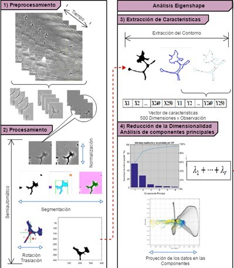

# Study-of-the-Growth-Cone-Dynamics

Growth cones are important structures for the formation of the central and peripheral nervous system, and for their maintenance during adulthood. The cones are highly dynamic structures, which travel through the tissues guiding axonal growth until they reach their target tissue.
The morphology of the growth cone is a parameter that indicates the functionality of the growth cone. This is important because the extent and directionality of the growth cone depends on this functionality[[1]](#1).

Studying geometric morphometry in the movements of growth cones requires addressing three challenges:

* The diffuse limits of the growth cones
* The lack of anatomical reference points.
* High dynamics of change in growth patterns over time.  

Unlike other anatomical structures, the contour of the growth cones may not be clearly defined, even in those cones that initially have clearly defined boundaries, it will happen that, through the phases of development their limits are diffuse, a threshold value could be chosen to define the limits of the cone, but the decision of an arbitrary threshold level could rule out valuable spatial information of the pattern, additionally, in a time-lapse there are strong changes between images, ranging from lighting changes to noise caused by other elements present in the medium that can occlude sections of the growth cone.  For the above reasons, it is essential to apply strategies that improve the images and thus increase the discriminatory information included and ensure that the factors mentioned above cannot negatively influence the extraction of characteristics. 

The second challenge concerns the variability of the cone shape, often lacking biological reference points to allow comparison between individuals. In this sense, the shape of the growth cone can be represented by separating it from the background of the image (segmentation) as a new binary image or mask and thus applying it to more than two dimensions (e.g. 2D shape + time). However, in a temporal study there is a high correlation between cones (redundant pixels), becoming a drawback for statistical analysis. One strategy to address this challenge is, __The Eigenshape Analysis__ described by MacLeod et al. [[2]](#2) and applied for the growth cone case by Goodhill et al. [[3]](#3). The Eigenshape Analysis represents the shape by means of the coordinates (x, y) of a set of reference points, placed around the perimeter of the cone and selected in such a way that they do not depend on the specific orientation of the cone ("invariant to rotation"), or by aligning the population so that similar regions are found in corresponding spatial locations. The new pairs of coordinates generated correspond to a vector of numbers that represent each contour as a point in N dimensional space, after this, __Principal Component Analysis__ (PCA) is used to obtain the directions in space in a way that captures the greatest proportion of variance [[3]](#3). 

The third challenge, related to the rapid change of shape, size and position requires many samples (frames). This fact has a clear advantage, the handling of large numbers of samples aims to obtain better estimates of the variation in the shape of the growth cones.

### Prerequisites
```
Mathworks Matlab R2019b
```
<a href="https://github.com/jsaenzBimcv/Study-of-the-Growth-Cone-Dynamics/tree/main/growth_Cones_Segmentation/data">__Example data set__</a>

## Phases of the Study 

<p style="text-align:center">

</p>
<div style='text-align:center;'>

figure 1: Diagram of the morphological analysis process.
</div>


### Time-Lapse Processing, Growth Cone Segmentation

Using the tool  <a href="https://www.mathworks.com/help/images/batch-processing-using-the-image-batch-processor-app.html">__Image Batch Processor__</a> (MathWorks), The segmentation and spatial normalization of the growth cones is carried out for a batch of images from a Time-Lapse in two stages:

1- __Parameter settings:__ a graphical user interface (GUI) is provided, which visually allows for segmentation, applying different settings to find the best one.

* Open your MATLAB and run the the following script:

  - <a href="https://github.com/jsaenzBimcv/Study-of-the-Growth-Cone-Dynamics/tree/main/growth_Cones_Segmentation"> growth_Cones_Segmentation/conesSegmentation.m </a>
  
<p style="text-align:center">

</p>
<div style='text-align:center;'>

figure 2: Interfaz gráfica de usuario para la selección de parámetros de segmentación. 1-cargue una imagen, 2- mejore la información discriminativa aplicando una técnica de normalizacion de la luz, 3- búsqueda del mejor umbral para binarizar la imagen utilizando la función H-Min, 4-sí existen elementos que no pertenecen a la región de interés pueden ser eliminadas de la imagen binarizada, 5- Rotar verticalmente y normalizar la posición espacial del cono, 6- guardar los parámetros seleccionados.
</div>

2- __Procesamiento de parametros__:  
Los parametros seleccionados en el paso anterior y almacenados en <a href="https://github.com/jsaenzBimcv/Study-of-the-Growth-Cone-Dynamics/tree/main/growth_Cones_Segmentation/config"> growth_Cones_Segmentation/config/config.dat </a>, se utilizan para segmentar un Time-Lapse, en este caso de 120 imágenes.

* Run the Image Batch Processor with the following script:

  - <a href="https://github.com/jsaenzBimcv/Study-of-the-Growth-Cone-Dynamics/tree/main/growth_Cones_Segmentation"> growth_Cones_Segmentation/automaticConesSegmentation.m </a>

<p style="text-align:center">

</p>
<div style='text-align:center;'>

figure 3: Segmentación de un Time-Lapse (120 imagenes) utilizando la herramienta <a href="https://www.mathworks.com/help/images/batch-processing-using-the-image-batch-processor-app.html"> Image Batch Processor</a> (MathWorks) .
</div>

When used by the App, this function will be called for every input image
% file automatically. IM contains the input image as a matrix. RESULTS is a
% scalar structure containing the results of this processing function.


### Extracción de características 

La técnica utilizada para la extracción de información referente a la forma del objeto (basada en contornos), es el __análisis Eigenshape__.
Eigenshape utiliza los datos de coordenadas (X,Y) del contorno del cono de crecimiento como un vector que describe la forma. Sin embargo, la lista de coordenadas que representan el contorno del cono, no se pueden comparar inmediatamente con otro contorno, estos puntos no estan espaciados de la misma manera, por lo que es necesario crear un nuevo conjunto que esté espaciado uniformemente a lo largo de la misma curva.

Para esto es necesario interpolar el conjunto de puntos a distancias fijas a lo largo de la curva en el espacio (2D) que forma el contorno. El método utilizado para calcular los puntos a lo largo de la curva, fue la interpolación cubica de Hermite a trozos (calculados usando pchip en Matlab (MathWorks, s.f.)). 

* Open your MATLAB and run the following script:
```
seg_Cone_Morphology/conesSegmentation.m
```

### Análisis de componentes principales 

El conjunto de coordenadas debe reducirse a una forma comprensible (de baja dimensión), para ello, la herramienta utilizada es el análisis de componentes principales (PCA). De esta forma, es posible mostrar los conos de crecimiento como puntos en un diagrama de dispersion bidimensional o tridimensional sin perder mucha información, indicando las principales direcciones de variación de la forma dentro de la muestra.

* Open your MATLAB and run the following script:
```
seg_Cone_Morphology/conesSegmentation.m
```


## Authors

* **Muñoz Lasso, DC.** (2017). - *Doctoral Thesis* - Fisiopatología de la ataxia de Friedreich: Transporte y degeneración axonal. Universitat Politècnica de València. ( https://doi.org/10.4995/Thesis/10251/92842)
* **Sáenz Gamboa, JJ.** (2017). - *Master Dissertation* - Estudio morfológico en Conos de Crecimiento Mediante Análisis de Componentes Principales Y Modelos Ocultos de Markov. Universitat Politècnica de València.

# References

<a id="1">[1]</a>  Muñoz Lasso, DC. (2017). Fisiopatología de la ataxia de Friedreich: Transporte y degeneración axonal. Universitat Politècnica de València. ( https://doi.org/10.4995/Thesis/10251/92842)

<a id="2">[2]</a>  MacLeod, N. (1999). Generalizing and extending the eigenshape method of shape space visualization and analysis. Paleobiology, 107-138.

<a id="3">[3]</a>  Goodhill, G. J., Faville, R. A., Sutherland, D. J., Bicknell, B. A., Thompson, A. W., Pujic, Z., ... & Scott, E. K. (2015). The dynamics of growth cone morphology. BMC biology, 13(1), 10.

## License

The Study-of-the-Growth-Cone-Dynamics is free and open source for academic/research purposes (non-commercial)¹.

¹ Some algorithms of the Study-of-the-Growth-Cone-Dynamics are free for commercial purposes and others not. First you need to contact the authors of your desired algorithm and check with them the appropriate license.

This project is licensed under the MIT License - see the [LICENSE.md](LICENSE.md) file for details


 ## Rights and permissions.

 <a rel="license" href="http://creativecommons.org/licenses/by/4.0/"></a><br />This work is licensed under a <a rel="license" href="http://creativecommons.org/licenses/by/4.0/">Creative Commons Attribution 4.0 International License</a>., which permits use, sharing, adaptation, distribution and reproduction in any medium or format, as long as you give appropriate credit to the original author(s) and the source, provide a link to the Creative Commons license, and indicate if changes were made. The images or other third party material in this article are included in the article's Creative Commons license, unless indicated otherwise in a credit line to the material. If material is not included in the article's Creative Commons license and your intended use is not permitted by statutory regulation or exceeds the permitted use, you will need to obtain permission directly from the copyright holder.


## Acknowledgments

This research was developed as part of the PhD research: __Study of the dynamics of axonal growth of sensory neurons in the yg8sr mouse model for Friedreich's ataxia__.
Researcher: __Dr. Diana Carolina Muñoz Lasso__, Universitat Politècnica de València. http://hdl.handle.net/10251/45095

In collaboration with: 
* <a href="https://www.uv.es/ciberer2/index.wiki">Laboratorio de Fisiopatología de las Enfermedades Raras</a>, Universitat de València
* <a href="http://www.cipf.es/cipf-fisabio-joint-research-unit-biomedical-imaging">Biomedical Imaging Mixed Joint Unit, Foundation for the Promotion of Health and Biomedical Research (FISABIO) and the Principe Felipe Research Center (CIPF), València, Spain.</a>


