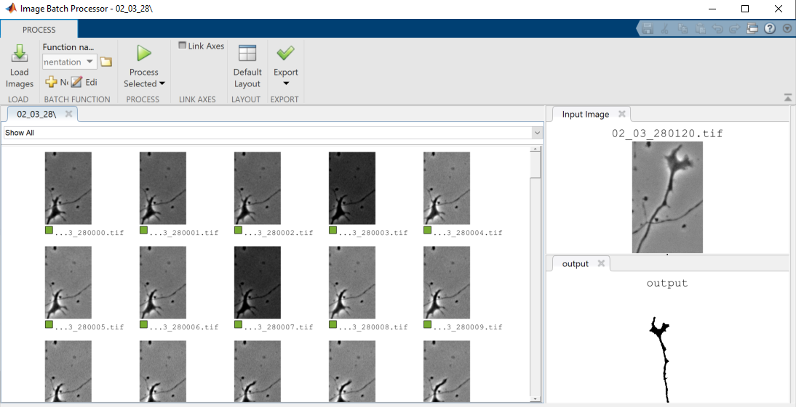
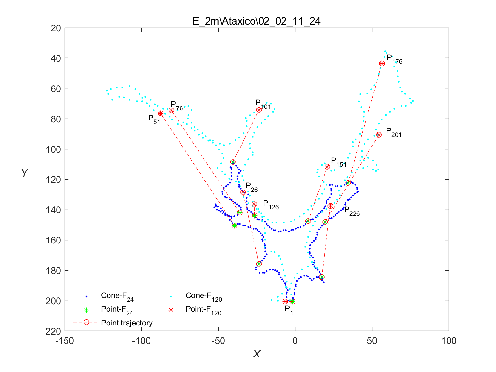

# Study of the Growth Cone Dynamics by Principal Component Analysis

Growth cones are important structures for the formation of the central and peripheral nervous system, and for their maintenance during adulthood. The cones are highly dynamic structures, which travel through the tissues guiding axonal growth until they reach their target tissue.
The morphology of the growth cone is a parameter that indicates the functionality of the growth cone. This is important because the extent and directionality of the growth cone depends on this functionality[[1]](#1).

Studying geometric morphometry in the movements of growth cones requires addressing three challenges:

* The diffuse limits of the growth cones
* The lack of anatomical reference points.
* High dynamics of change in growth patterns over time.  

Unlike other anatomical structures, the contour of the growth cones may not be clearly defined, even in those cones that initially have clearly defined boundaries, it will happen that, through the phases of development their limits are diffuse, a threshold value could be chosen to define the limits of the cone, but the decision of an arbitrary threshold level could rule out valuable spatial information of the pattern, additionally, in a time-lapse there are strong changes between images, ranging from lighting changes to noise caused by other elements present in the medium that can occlude sections of the growth cone.  For the above reasons, it is essential to apply strategies that improve the images and thus increase the discriminatory information included and ensure that the factors mentioned above cannot negatively influence the extraction of characteristics. 

The second challenge concerns the variability of the cone shape, often lacking biological reference points to allow comparison between individuals. In this sense, the shape of the growth cone can be represented by separating it from the background of the image (segmentation) as a new binary image or mask and thus applying it to more than two dimensions (e.g. 2D shape + time). However, in a temporal study there is a high correlation between cones (redundant pixels), becoming a drawback for statistical analysis. One strategy to address this challenge is, __The Eigenshape Analysis__ described by MacLeod et al. [[2]](#2) and applied for the growth cone case by Goodhill et al. [[3]](#3). The Eigenshape Analysis represents the shape by means of the coordinates (x, y) of a set of reference points, placed around the perimeter of the cone and selected in such a way that they do not depend on the specific orientation of the cone ("invariant to rotation"), or by aligning the population so that similar regions are found in corresponding spatial locations. The new pairs of coordinates generated correspond to a vector of numbers that represent each contour as a point in N dimensional space, after this, __Principal Component Analysis__ (PCA) is used to obtain the directions in space in a way that captures the greatest proportion of variance [[3]](#3). 

The third challenge, related to the rapid change of shape, size and position requires many samples (frames). This fact has a clear advantage, the handling of large numbers of samples aims to obtain better estimates of the variation in the shape of the growth cones.

## Prerequisites
```
Mathworks Matlab R2019b
```
<a href="https://github.com/jsaenzBimcv/Study-of-the-Growth-Cone-Dynamics/tree/main/data">__Example data set__</a>

## Phases of the Study 

In figure 1. You can see, a schematic with the steps involved in the Eigenshape Analysis to extract the shape dimensions that capture most variance: 1. Growth cone segmentation procedure, 2. Feature extraction, from 250 evenly spaced contour coordinates, 3. Principal component analysis, Graphic representation of the components with the highest variance.

<p style="text-align:center">

</p>
<div style='text-align:center;'>

figure 1: Diagram of the morphological analysis process.
</div>

### 1. Time-Lapse Processing, Growth Cone Segmentation

Using the tool  <a href="https://www.mathworks.com/help/images/batch-processing-using-the-image-batch-processor-app.html">__Image Batch Processor__</a> (MathWorks), The segmentation and spatial normalization of the growth cones is carried out for a batch of images from a Time-Lapse in two stages:

1- __Parameter settings:__ a Graphical User Interface (GUI) is provided, which visually allows for segmentation, applying different settings to find the best one.

* Open your MATLAB and run the the following script:

  - <a href="https://github.com/jsaenzBimcv/Study-of-the-Growth-Cone-Dynamics/tree/main/1-Growth_Cones_Segmentation"> 1-Growth_Cones_Segmentation/conesSegmentation.m </a>
  
<p style="text-align:center">

</p>
<div style='text-align:center;'>

figure 2: Graphical user interface for the selection of segmentation parameters. Actions: 1- Load an image, 2- Improve the discriminative information by applying a light normalization technique, 3- Search for the best threshold to binarise the image using the H-minima transform, 4- Elements not belonging to the region of interest can be removed from the binarised image, 5- Rotate vertically and normalize the spatial position of the growth cone, 6- Save the selected parameters.
</div>

2- __Parameter Processing__:  
The parameters selected in the previous step and stored in <a href="https://github.com/jsaenzBimcv/Study-of-the-Growth-Cone-Dynamics/tree/main/1-Growth_Cones_Segmentation/config"> 1-Growth_Cones_Segmentation/config/config.dat </a>, are used to segment a Time-Lapse, in this case from 120 images.

* Run the Image Batch Processor with the following script:

  - <a href="https://github.com/jsaenzBimcv/Study-of-the-Growth-Cone-Dynamics/tree/main/1-Growth_Cones_Segmentation"> 1-Growth_Cones_Segmentation/automaticConesSegmentation.m </a>

<p style="text-align:center">

</p>
<div style='text-align:center;'>

figure 3: Segmentation of a Time-Lapse (120 images) using the <a href="https://www.mathworks.com/help/images/batch-processing-using-the-image-batch-processor-app.html"> Image Batch Processor</a> (MathWorks) .
</div>

### 2. Feature Extraction  

The technique used for the extraction of information concerning the shape of the object (based on contours), is the __Eigenshape Analysis__.
Eigenshape uses the coordinate data (X,Y) of the contour of the growth cone as a vector that describes the shape. However, the list of coordinates that represent the contour of the cone, cannot be immediately compared with another contour, these points are not spaced in the same way, so it is necessary to create a new set that is evenly spaced along the same curve.

For this, it is necessary to interpolate the set of points at fixed distances along the curve in the space (2D) that forms the contour. The method used to calculate the points along the curve was the Piecewise Cubic Hermite Interpolating (calculated using pchip in Matlab (MathWorks)). 

* Open your MATLAB and run the following script:
```
2-Feature_Extraction/batch_Feature_Extraction.m
```
The funtion __batch_Feature_Extraction.m__, organizes the study classes and extracts the coordinates (x,y) of the contours from the binary images chosen in the previous step. 
When starting the script you must indicate the directory with the segmentations, which, must be organized as follows:
<div>
<pre>
<code>
Segmentation_Data/
├── class-01
│  ├──  cone-01
│  │   ├── frame-000.tif
│  │   ├── frame-001.tif
│  │   ├── ...
│  │   ├── frame-119.tif
│  ├──  cone-02
│  ├──  ...
│
├── class-02
│  ├──  cone-01
│  │   ├── frame-000.tif
│  │   ├── frame-001.tif
│  │   ├── ...
│  │   ├── frame-119.tif
│  ├──  cone-02
│  ├──  ...
</code>
</pre>
</div>

In <a href="https://github.com/jsaenzBimcv/Study-of-the-Growth-Cone-Dynamics/tree/main/data/segmentation_output/E_2m">data/segmentation_output/E_2m</a> you can see an example of the directory.

When finished, a new folder (/data) is generated with a coordinate file for each Time-lapse, the file name is coded as follows __contours_nameClass_nameCone.mat__.

contours_nameClass_nameCone.mat contains a matrix of size (X coordinates + Y coordinates) x frames, for this case 500x120, It is equivalent to 250 equidistant points in a 120-frame time-lapse. 

<p style="text-align:center">

</p>
<div style='text-align:center;'>
figure 4: Example of positioning of reference points in the frames 24 and 120.
</div>


### 3. Principal Component Analysis (PCA) 

The set of coordinates must be reduced to a comprehensible form (low dimension), for which the tool used is the Principal Component Analysis (PCA). In this way, it is possible to show the growth cones as points in a two- or three-dimensional scatter diagram without losing much information, indicating the main directions of shape variation within the sample.

* Open your MATLAB and run the following script:
```
seg_Cone_Morphology/conesSegmentation.m
```


## Authors

* **Muñoz Lasso, DC.** (2017). - *Doctoral Thesis* - Fisiopatología de la ataxia de Friedreich: Transporte y degeneración axonal. Universitat Politècnica de València. ( https://doi.org/10.4995/Thesis/10251/92842)
* **Sáenz Gamboa, JJ.** (2017). - *Master Dissertation* - Estudio morfológico en Conos de Crecimiento Mediante Análisis de Componentes Principales Y Modelos Ocultos de Markov. Universitat Politècnica de València.

## References

<a id="1">[1]</a>  Muñoz Lasso, DC. (2017). Fisiopatología de la ataxia de Friedreich: Transporte y degeneración axonal. Universitat Politècnica de València. ( https://doi.org/10.4995/Thesis/10251/92842)

<a id="2">[2]</a>  MacLeod, N. (1999). Generalizing and extending the eigenshape method of shape space visualization and analysis. Paleobiology, 107-138.

<a id="3">[3]</a>  Goodhill, G. J., Faville, R. A., Sutherland, D. J., Bicknell, B. A., Thompson, A. W., Pujic, Z., ... & Scott, E. K. (2015). The dynamics of growth cone morphology. BMC biology, 13(1), 10.

 ## Rights and permissions.

 <a rel="license" href="http://creativecommons.org/licenses/by/4.0/"></a><br />This work is licensed under a <a rel="license" href="http://creativecommons.org/licenses/by/4.0/">Creative Commons Attribution 4.0 International License</a>., which permits use, sharing, adaptation, distribution and reproduction in any medium or format, as long as you give appropriate credit to the original author(s) and the source, provide a link to the Creative Commons license, and indicate if changes were made. The images or other third party material in this article are included in the article's Creative Commons license, unless indicated otherwise in a credit line to the material. If material is not included in the article's Creative Commons license and your intended use is not permitted by statutory regulation or exceeds the permitted use, you will need to obtain permission directly from the copyright holder.

## Acknowledgments

This research was developed as part of the PhD research: __Study of the dynamics of axonal growth of sensory neurons in the yg8sr mouse model for Friedreich's ataxia__.
Researcher: __Dr. Diana Carolina Muñoz Lasso__, Universitat Politècnica de València. http://hdl.handle.net/10251/45095

In collaboration with: 
* <a href="https://www.uv.es/ciberer2/index.wiki">Laboratorio de Fisiopatología de las Enfermedades Raras</a>, Universitat de València
* <a href="http://www.cipf.es/cipf-fisabio-joint-research-unit-biomedical-imaging">Biomedical Imaging Joint Unit, Foundation for the Promotion of Health and Biomedical Research (FISABIO) and the Principe Felipe Research Center (CIPF), València, Spain.</a>
